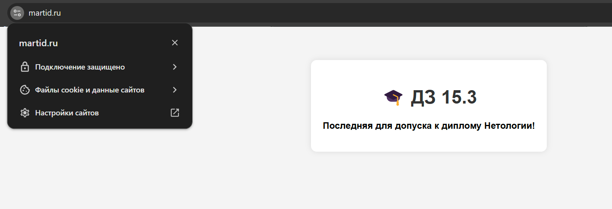

# Домашнее задание к занятию «Безопасность в облачных провайдерах»  

Используя конфигурации, выполненные в рамках предыдущих домашних заданий, нужно добавить возможность шифрования бакета.

---
## Задание 1. Yandex Cloud   

1. С помощью ключа в KMS необходимо зашифровать содержимое бакета:

 - создать ключ в KMS;
 - с помощью ключа зашифровать содержимое бакета, созданного ранее.

2. (Выполняется не в Terraform)* Создать статический сайт в Object Storage c собственным публичным адресом и сделать доступным по HTTPS:

 - создать сертификат;
 - 
   
 - создать статическую страницу в Object Storage и применить сертификат HTTPS;
 - в качестве результата предоставить скриншот на [страницу](https://martid.ru) с сертификатом в заголовке (замочек).

 

Полезные документы:

- [Настройка HTTPS статичного сайта](https://cloud.yandex.ru/docs/storage/operations/hosting/certificate).
- [Object Storage bucket](https://registry.terraform.io/providers/yandex-cloud/yandex/latest/docs/resources/storage_bucket).
- [KMS key](https://registry.terraform.io/providers/yandex-cloud/yandex/latest/docs/resources/kms_symmetric_key).
